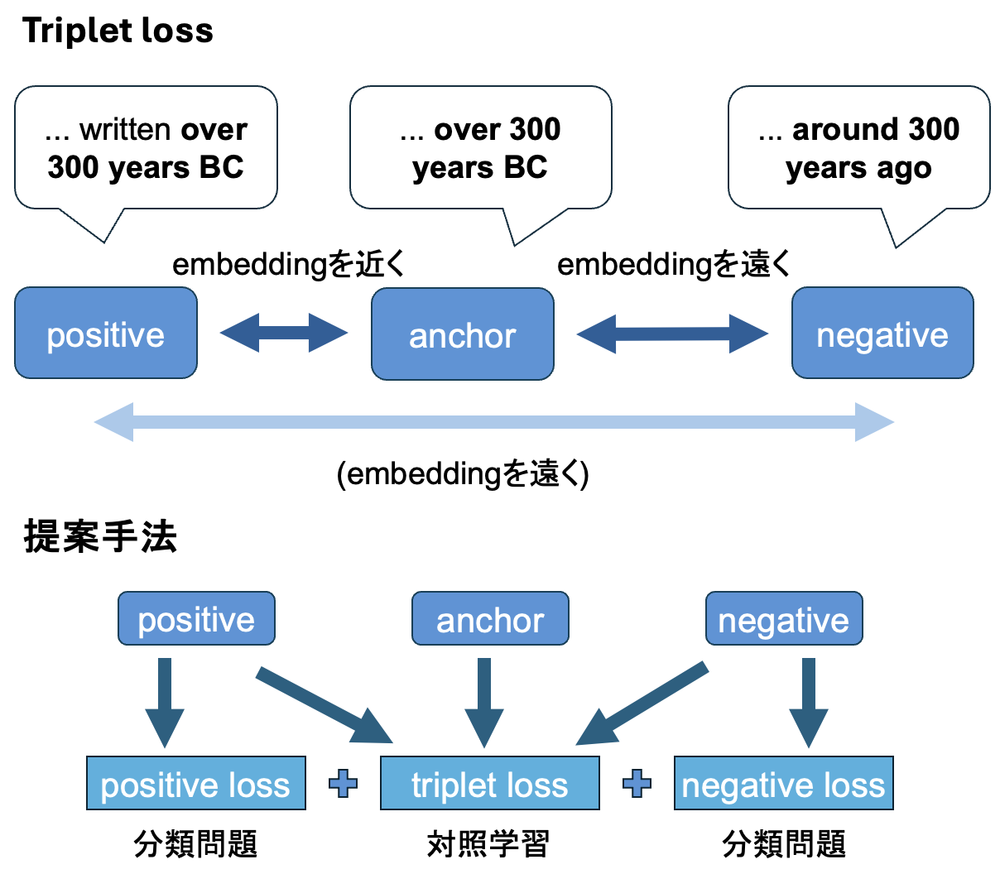

# nlp2025



## raw_rag_truth_dataset/
実験のために用いた[RAGTruthデータセット](https://github.com/ParticleMedia/RAGTruth) (Wu+, 2023) の生データが含まれている。
`source_info.jsonl`に入力文章が、`response.jsonl`に出力文章が記述されている。
## dataset/
RAGTruthデータセットを本研究に対応した形式に加工したものが含まれている。
各データセットは`create_dataset.py`で生成可能である (`rag_truth_span_test_sim.json`のみ`check_improve_rob.ipynb`)。
### rag_truth_{train, dev,test}.json
検出器の訓練/評価のために用いたデータセットである。
RAGTruthではtrain/testのラベルが割り当てられていたがdevセットが存在しなかったため、trainセットからランダムにサンプリングしてdevセットとした。

訓練した検出器では、`"ref"`や`"text"`を入力として`"labels"`を予測する。
| Field name| Field value | Description |
| --- | --- | --- |
| ref |String| 入力文章 |
| text | String | 出力文章 |
| labels | Int (0 or 1)| 文章中にhallucinationが含まれるかどうかのラベル。hallucinationが含まれていれば1、含まれていなければ0。 |
| source | String | 入力文章が含まれていたデータセット。後述の`"source_type"`が`"QA"`であれば`"MARCO"` (MS MARCO, Nguyen+, 2016) 、`"Data2txt"`であれば`"Yelp"` (Yelp Open Dataset, Yelp, 2021) 、`"Summary"`であれば`"CNN/DN"` (CNN/Daily Mail dataset See+, 2017) もしくは`"Recent News"`。|
| model | String | 入力文章から出力文章を生成するときに使用したモデルであり、`"gpt-4-0613"`、`"gpt-3.5-turbo-0613"`、`"mistral-7B-instruct"`、`"llama-2-7b-chat"`、`"llama-2-13b-chat"`、`"llama-2-70b-chat"`の6つである。1つの入力文章に対してこれら6モデルでそれぞれ出力文章を生成した。(1つの入力文章に対して6つの出力文章が存在する。) |
| task_type | String | 生成タスク。 `"QA"` (質問 → 回答) 、`"Data2txt"` (json → 自然文) 、`"Summary"` (ニュース要約前 → 要約後) | 
|source_id | String | それぞれの入力文に割り当てられた固有ID

```json
{
    "ref": "Andrew Getty, one of the heirs to billions of oil money, appears to have died of natural causes, a Los Angeles Police Department spokesman said. ...  People we've lost in 2015. CNN's Doug Criss, Janet DiGiacomo, Mark Mooney, Mike Love, Julie In and Cheri Mossburg contributed to this report.\n",
    "text": "Andrew Getty, oil tycoon J. Paul Getty's grandson, has died at the age of 47. ...  The Getty family fortune is estimated to be about $5 billion.",
    "labels": 0,
    "source": "CNN/DM",
    "model": "gpt-4-0613",
    "task_type": "Summary",
    "source_id": "15593"
}
```
### rag_truth_span_{train, dev, test}.json
訓練した検出器の分析を行うためのより詳細なデータセット。
Hallucinationの具体的な箇所と、それぞれについてのメタデータが含まれる。
追加された要素を以下に示す。
| Field name| Field value | Description |
| --- | --- | --- |
| hallucination_id | List\[Dict\] | `"start"`と`"end"`はhallucinationが起こっている箇所の開始位置と終了位置を表す。`"text"`はhallucination箇所を抜き出したもの、`"meta"`はアノテーターが根拠などを記述したものを表す。`"label_type"`はRAGTruth内で定義されているhallucinationタイプの分類、`"implict_true"`は入力文章からは推論できない情報であるが実際には正しい情報であるか、`"due_to_null"`はData-to-textタスクにおいてvalueがnullであるために発生したhallucinationであるかを示す。 |
| hallucination | Dict | `"hallucination_list"`にhallucinationが起こっている箇所を抜き出したものが含まれる。

```json
{
    "ref": "Andrew Getty, one of the heirs to billions of oil money, ... Julie In and Cheri Mossburg contributed to this report.\n",
    "text": "Andrew Getty, oil tycoon J. Paul Getty's grandson, ...  The Getty family fortune is estimated to be about $5 billion.",
    "labels": 1,
    "hallucination_id": [
        {
            "start": 280,
            "end": 327,
            "text": "His net worth was estimated to be $2.1 billion.",
            "meta": "EVIDENT CONFLICT:\nOriginal:  Gordon Getty whose net worth is stated as $2.1 billion.\nAIGC: Andrew Getty's net worth was estimated to be $2.1",
            "label_type": "Evident Conflict",
            "implicit_true": false,
            "due_to_null": false
        }
    ],
    "hallucination": {
        "hallucination_list": [
            "His net worth was estimated to be $2.1 billion."
        ]
    },
    "source": "CNN/DM",
    "model": "llama-2-13b-chat",
    "task_type": "Summary",
    "source_id": "15593"
}
```

## models_{rob, phi}.py
`models_rob.py`にはベースモデルにRoBERTaを用いる場合の各手法が、`models_phi.py`にはphi-3.5-mini-instructを用いる場合の各手法のモデルが記述されている。

エンコーダーモデルであるRoBERTaでは、ベースモデルからの出力を獲得する際に`pooler_output`を用いる。
```python
text_output = self.base_model(input_ids=input_ids, attention_mask=attention_mask)[1]
```
デコーダーモデルであるphi-3.5-mini-instructではベースモデルからの出力を獲得する際に、最終層の最終トークンに対する出力を用いる。
```python
text_output = self.base_model(input_ids=input_ids, attention_mask=attention_mask)[0][:, -1, :] 
```
### NoDocModel (入力文章を用いないベースライン)
入力文章を用いず判別対象である出力文章のみを入力して、出力文章中にhallucinationが含まれるかを二値分類で判別する。
### WithDocModel (入力文章を用いた分類を行うベースライン)
入力文章と判別対象である出力文章を結合して入力し、出力文章中にhallucinationが含まれるかを二値分類で判別する。
損失関数にはtriplet lossを用いず、分類のクロスエントロピー損失のみを用いた。
### TripletModel (提案手法)
入力文章と出力文章を入力し、triplet lossを用いた対照学習を行う。
推論時は入力文章と出力文章を結合して出力文章中にhallucinationが含まれるかを二値分類で判別する。

## {no_doc, with_doc, triplet}_{rob, phi}.ipynb
各手法と各ベースラインに対応した検出器を訓練するためのコードが含まれている。
訓練済みの検出器は`./trained`以下に保存される。

## check_improve_{rob, phi}.py
訓練した検出器について分析を行うためのコードが含まれている。
testセットの各事例について各モデルで推論を行い、結果を`check_improve_{rob, phi}.json`に保存する。
jsonファイルの中身は以下の通りである。
| Field name| Field value | Description |
| --- | --- | --- |
| id | Int | 各事例に固有のID |
| label | Int (0 or 1)| 文章中にhallucinationが含まれるかどうかのラベル。hallucinationが含まれていれば1、含まれていなければ0。|
| task | String | 生成タスクの種類、`"QA"`、`"Data2txt"`、`"Summary"`のいずれかである。
| {no_rag, rag, triplet}_logits | List\[Int\] | それぞれ`NoDocModel`、`WithDocModel`、`TripletModel`で推論した際のlogitsである。0要素目が`positive_logits` (hallucinationを含まない)、1要素目が`negative_logits` (hallucinationを含む)。
| {no_rag, rag, triplet}_label | Int | それぞれ`NoDocModel`、`WithDocModel`、`TripletModel`で推論した際の判別結果である。 | 

`id_abc`という配列に各モデルの推論結果の比較に基づいて事例のIDを分類して格納するコードが含まれている。(`a`、`b`、`c`には0もしくは1が入る)
手法1での結果が`a`で手法2での結果が`b`であり、正解ラベルが`c`である事例のIDが`id_abc`に格納される。
### check_improve_rob.py
ベースモデルとしてRoBERTaを用いた場合の分析を行うことができる。
各訓練済み検出器における`text`のembeddingを二次元で可視化するためのコードが含まれている。
また、各訓練済み検出器と訓練前のベースモデルについてテストセットの入力文章と出力文章のコサイン類似度を計算した結果を`dataset/rag_truth_span_test_sim.json`に保存してあり、グラフで可視化を行うことができる。(現在のファイルでは`"sim_triplet"`キーが`"triplet"`キーになっている)
### check_improve_phi.py
ベースモデルとしてphi-3.5-mini-instructを用いた場合の、hallucinationのタイプに基づく分析と、事例の生成モデルに基づく分析を行うことができる。